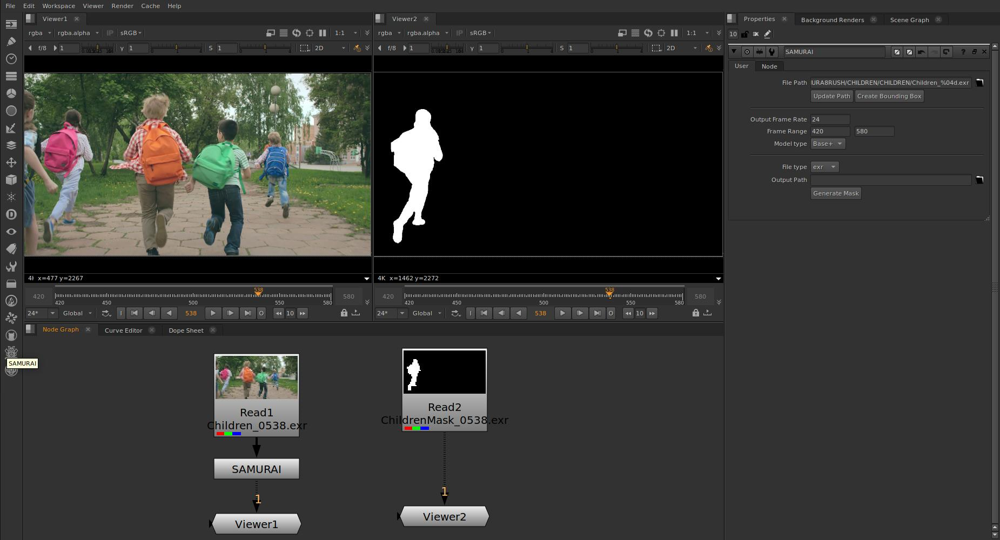

<div align="center">

# SAMURAI for NUKE

Adapted by 
<br><br>
[Theo SAMINADIN](https://github.com/Theo-SAMINADIN-td)

<br>
<div align="center"> SAMURAI FROM </div>

[Cheng-Yen Yang](https://yangchris11.github.io), [Hsiang-Wei Huang](https://hsiangwei0903.github.io/), [Wenhao Chai](https://rese1f.github.io/), [Zhongyu Jiang](https://zhyjiang.github.io/#/), [Jenq-Neng Hwang](https://people.ece.uw.edu/hwang/)

[Information Processing Lab, University of Washington](https://ipl-uw.github.io/) 

<br>

</div>
<div style="display: flex;">
  
  <br><br>
</div>


https://github.com/user-attachments/assets/9d1d69ec-ff81-418f-bb70-d62226037bdf


## Introduction
**Samurai for Nuke** allows you to generate masks from an image sequence, based on SAMURAI adaptation of SAM2 Model for Zero-Shot Visual Tracking with Motion-Aware Memory.
<br><br>
💡 **Additional features:**

- Mask export
- EXR input/output
- Frame range
- Bounding Box Interface

<br>

## 🗒️ Requirements
- Ubuntu>=20.04
- Nuke>=15 (not tested on previous versions)
- python>=3.10
- torch>=2.3.1
- torchvision>=0.18.1

<br>

## 🛠️ Installation


https://github.com/user-attachments/assets/ba6d3801-472c-49ea-ba7a-eba28efc8f94


### 1. Clone this repo into your Nuke/plugins folder (usually /home/nuke15.1/plugins/):
```bash
git clone https://github.com/Theo-SAMINADIN-td/NukeSamurai.git
```
Or Download this repo as [ZIP file](https://github.com/Theo-SAMINADIN-td/NukeSamurai/archive/refs/heads/main.zip) and extract it in your Nuke/plugins folder (Rename the folder correctly: NukeSamurai)
<br><br>

Your files should be structured like this:
```
Nuke
├── plugins/
│   ├── NukeSamurai/
│   │   ├── sam2_repo/
│   │   ├── scripts/
│   │   │   ├── demo.py
│   │   │   ├── nuke_samurai.py
│   │   ├── icons/
│   │   ├── init.py
│   │   ├── menu.py
│   ├── ...
│   ├── init.py 
│   ├── menu.py
├── ...
```
<br>


In **Nuke/plugins/init.py** (not NukeSamurai/init.py) add:
```
nuke.pluginAddPath("NukeSamurai")
```
<br>

In **NukeSamurai/init.py** (not Nuke/plugins/init.py) remove the "#" and add your environment path:
```
nuke.pluginAddPath("path/to/Python310/Lib/site-packages", addToSysPath=True)
```

<br>

### 2. Install dependencies


If ``torch>=2.3.1`` and ``torchvision>=0.18.1`` are not already installed:
```
pip install torch==2.3.1+cu118 torchvision==0.18.1 --extra-index-url https://download.pytorch.org/whl/cu118
```
<br>

```
cd NukeSamurai/sam2_repo
pip install -e .
pip install -e ".[notebooks]"
```

For potential installation issues, check **SAMURAI** [Issues and Solutions](https://github.com/yangchris11/samurai/issues) and **SAM2** [INSTALL.md](https://github.com/facebookresearch/sam2/blob/main/INSTALL.md)

Install other requirements:
```
pip install matplotlib==3.7 tikzplotlib jpeg4py opencv-python lmdb pandas scipy loguru ninja
```

#### SAM 2.1 Checkpoint Download
```
cd checkpoints && \
./download_ckpts.sh && \
cd ..
```

# 👌 Launch Nuke!
